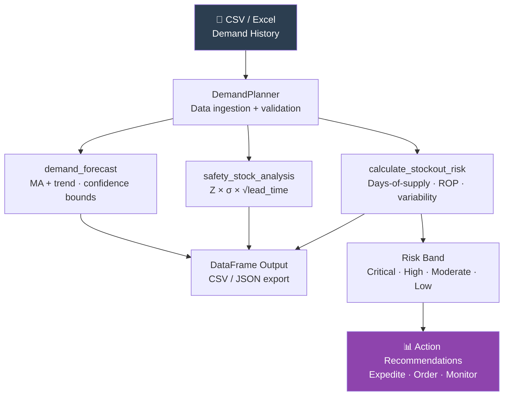

# 📦 Supply Chain Demand Planner


Moving-average demand forecasting, safety stock calculation, reorder point analysis, and stockout risk scoring for pharmaceutical and nature-based solutions (NbS) project supply chains. Built for operations and logistics analysts managing multi-SKU inventory with variable lead times.

---

## 🎯 Features

- **Demand Forecasting** — Moving-average with trend adjustment, per-SKU lower/upper confidence bounds
- **Safety Stock Calculation** — Z-score based (95% service level default), lead-time weighted
- **Reorder Point Analysis** — Per-SKU ROP = avg demand × lead time + safety stock
- **Stockout Risk Scoring** — 0–100 composite score combining days-of-supply, demand variability, and ROP breach
- **Risk Band Classification** — Critical / High / Moderate / Low with automated action recommendations
- **Descriptive Analytics** — Summary stats, missing data flagging, period-over-period analysis
- Supports CSV and Excel input formats

---

## 📦 Quick Start

**Step 1: Clone**
```bash
git clone https://github.com/achmadnaufal/supply-chain-demand-planner.git
cd supply-chain-demand-planner
```

**Step 2: Install**
```bash
pip install -r requirements.txt
```

**Step 3: Run demo**
```bash
python3 demo/run_demo.py
```

---

## 💡 Usage

```python
from src.main import DemandPlanner

planner = DemandPlanner(config={
    "ma_window": 3,           # Moving average window (periods)
    "service_level_z": 1.65,  # Z-score → 95% service level
    "lead_time_periods": 4,   # Supplier lead time in periods
})

df = planner.load_data("sample_data/demand_history.csv")

# Step 1: Demand forecast (next 3 periods)
forecast = planner.demand_forecast(df, periods_ahead=3)

# Step 2: Safety stock per SKU
safety = planner.safety_stock_analysis(df)

# Step 3: Stockout risk (requires current stock column)
risks = planner.calculate_stockout_risk(
    stock_df, sku_col="sku_id", demand_col="demand_qty", stock_col="current_stock"
)
print(risks[["sku_id", "days_of_supply", "risk_band", "recommended_action"]])
```

## Data Format

Expected CSV columns:
```
sku_id, sku_name, period, demand_qty, unit_cost_usd, supplier, lead_time_weeks
```

---

## 📊 Example Output

```
$ python3 demo/run_demo.py
==============================================================
  Supply Chain Demand Planner — Demo
  NbS Field Supply: Seed · Fertilizer · Planting Tools
==============================================================

✓ Loaded 18 demand records from demand_history.csv
  SKUs    : 3 (SKU-SEED-01, SKU-FERT-02, SKU-TOOL-03)
  Periods : 2025-01 → 2025-06

✓ Demand Forecast (next 3 periods, 3-period MA + trend):
  SKU               Period   Forecast    Lower    Upper
  ------------------------------------------------------
  SKU-FERT-02            1       15.2     13.9     16.4
  SKU-FERT-02            2       15.7     14.4     16.9
  SKU-FERT-02            3       16.2     14.9     17.4
  SKU-SEED-01            1      530.8    512.4    549.2
  SKU-SEED-01            2      543.3    524.9    561.7
  SKU-SEED-01            3      555.8    537.4    574.2
  SKU-TOOL-03            1       30.7     28.6     32.7

✓ Safety Stock & Reorder Points:
  SKU             Avg Demand  Std Dev  Safety Stock  Reorder Point
  ----------------------------------------------------------------
  SKU-FERT-02           13.5      1.7           5.6           59.6
  SKU-SEED-01          499.2     28.9          95.5        2,092.1
  SKU-TOOL-03           27.3      3.2          10.7          120.1

✓ Stockout Risk Assessment:
  SKU             Stock  Days Supply  Risk Score  Band      Action
  ----------------------------------------------------------------
  SKU-FERT-02        5          0.3        65.3   High      Place order within 48h
  SKU-SEED-01      350          0.7        59.9   High      Place order within 48h
  SKU-TOOL-03      120          3.8        13.8   Low       Monitor per standard schedule

==============================================================
  ✅ Demo complete
==============================================================
```

---

## 🗺️ Architecture



---

## 📁 Project Structure

```
supply-chain-demand-planner/
├── src/
│   ├── main.py               # DemandPlanner — core engine
│   ├── demand_forecaster.py  # MA + trend forecasting
│   └── supply_chain_risk.py  # Stockout risk scoring
├── sample_data/
│   ├── demand_history.csv    # 18 rows: 3 SKUs × 6 months (NbS supplies)
│   └── example_data.csv      # Generic demand dataset
├── demo/
│   └── run_demo.py           # End-to-end demo script
├── tests/                    # pytest unit tests
├── requirements.txt
└── README.md
```

---

## 🧮 Key Formulas

```
Safety Stock = Z × σ_demand × √lead_time
Reorder Point = (avg_demand × lead_time) + safety_stock
Days of Supply = current_stock ÷ avg_daily_demand

Risk Score (0–100):
  Base risk    = max(0, (lead_time - days_supply) / lead_time × 60)
  Variability  = min(30, CoV × 60)
  ROP breach   = +10 if stock < reorder_point
```

---

## 🛠️ Tech Stack

| Tool | Purpose |
|---|---|
| **Python 3.9+** | Core language |
| **pandas** | Data manipulation |
| **numpy** | Statistical calculations |
| **scipy** | Statistical distributions |
| **pytest** | Unit testing |

---

## 🧪 Testing

```bash
pytest tests/ -v
```

---

## 📄 License

MIT License

---

> Built by [Achmad Naufal](https://github.com/achmadnaufal) | Lead Data Analyst | Power BI · SQL · Python · GIS
